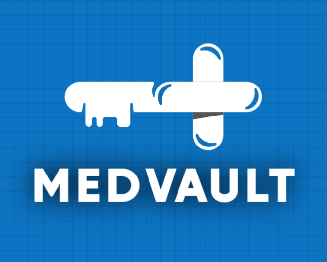

# MedVault

MedVault is a platform for storing your important Medical Details on the Blockchain for easy access in case of an emergency. 
The problem we hoped to solve with our project was the situation where a person might face an emergency and he/she must be rushed to the Hospital. Generally, It is 
imperative to fill out many formalities required by the Hospital before the Treatment started. Apart from this the knowledge of allergies, Past Illnesses, etc. 
is also very important. These details are very sensitive and very important thus they can not be stored on a Centralized system. Our solution aims to solve this 
by using Blockchain and making the storage Decentralized. 

## Features

* Ease of use :sparkles: : *We do not want to reinvent the wheel and make the process difficult for anyone.* Our application is a simple web application that has just 3 options, These are explained below:
  * Add New User: It redirects the user to a form that allows them to register in MedValut. The user fills all the data that he/she wants to store in the form and presses submit.
  * Generate OTP: When the user wants to use MedVault to access the stored Data on the BlockChain, They can use this option. 
  * Access Information: This will be used by the Medical Professionals as well as the users whenever they want to retrive the data of a particular user. The user will share the OTP with the Medical professional and then He/She can recover the data of that particular user.

* Secure::sparkles: *All the data of the user is stored in the Ethereum Blockchain.* This makes the application Secure and a perfect fit for storing sensitive information like Medical Records.

## Installation Steps

Replicating our application is fairly easy. Some required dependencies are:
1. Ganache
2. Truffle
3. Metamask Extension
4. node

After ensuring these are installed and Ganache is running one can start the application by the following commands:

1. `npm install`
2. `truffle compile`
3. `truffle migrate --reset`
4. `npm run dev`

## Challenges

*A smooth sea never made a skilled sailor! We're glad to acknowledge our learnings through the process.*
The project taught us many valuable insights and was very fruitful. The major learnings from the project are as follows:
1. The Implementation of the BlockChain was a very difficult task for us as this was the first BlockChain Project done by the Team. We learned a lot about the implementation and the execution.
2. Creating a Database using maps was very intuitive and was a new concept for us that we have implemented in this project. 
Along with that the retrieval of the data was another big challenge for us since the retrieval must be such that the data is not permanently 
shared with the hospitals.
3. The OTP generating functionality was another important part of the project that was very interesting to implement. 

## TechStack

* HTML
* CSS
* JavaScript
* Truffle
* Ganache
* Solidity

## Tools
* VS Code
* Firefox
* Git and Github

## ScreenShots
